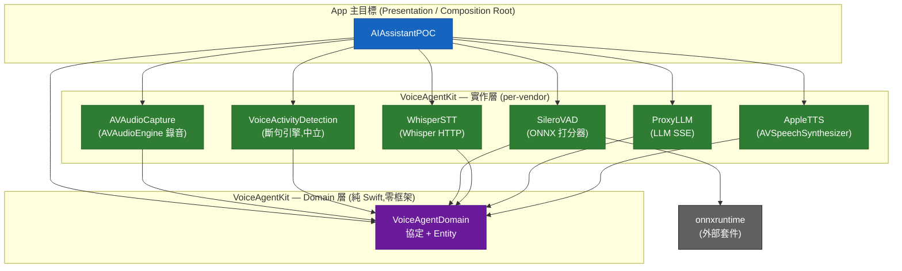

# 模組依賴關係圖 (Module Dependency Graph)

> 來源：掃描 `VoiceAgentKit/Package.swift` 與 `AIAssistantPOC` 主目標的實際 `import` 宣告
> 更新日期：2026-06-06（Domain 隔離 + 嚴格 per-vendor 重構後）

## 高層級依賴關係圖

> App 是唯一連結具體 vendor 模組的節點（Composition Root）。其餘 App 內部檔案（ViewModel / Pipeline / Preview）只 `import VoiceAgentDomain`。
> `VoiceActivityDetection`（斷句引擎）只依賴 Domain 的 `SpeechProbabilityScoring` 協定;`SileroVAD`（打分器）由 App 在組裝時注入,兩者無直接依賴。

## App 端 import 對照（DIP 成果）

| 檔案 | import | 說明 |
| --- | --- | --- |
| `AIAssistantPOCApp.swift` | Domain + 全部 6 個 vendor 模組 | Composition Root,唯一連結具體實作處 |
| `VoiceSessionViewModel.swift` | 只 `VoiceAgentDomain` | 僅依賴協定 |
| `ConversationManager.swift` | 只 `VoiceAgentDomain` | 持有 `LLMResponding` 協定 |
| `SpeechPipeline.swift` | 只 `VoiceAgentDomain` | 持有 `SpeechRecognizing` 協定 |
| `RecorderView.swift` | `VoiceActivityDetection` | `#Preview` 建構 `SpeechEndpointDetector` |
| `PreviewAudioRecorder` / `PreviewSpeechSynthesizer` | 只 `VoiceAgentDomain` | 協定的測試替身 |

---

## 審視結果

### 1. 箭頭方向是否符合 Clean Architecture？

**完全符合。** ✅

- 依賴單向向內流動：`App ──▶ 實作層 ──▶ VoiceAgentDomain`。
- **Domain 為純 Swift、零框架依賴**（只 `import Foundation`），所有協定（`SpeechSynthesizing`、`SpeechRecognizing`、`LLMResponding`、`AudioRecording`、`VoiceActivityDetecting`、`SpeechProbabilityScoring`）與 Entity（`AudioFrame`、`Transcription`、`LLMMessage`、`VADConfiguration`…）皆住在此。
- 高階抽象與低階實作已在**編譯邊界**上隔離,DIP 由模組邊界強制,而非僅靠命名約定。先前「協定與框架實作同 target」的保留點已消除。

### 2. 是否有環狀依賴？

**沒有。** ✅ 所有實作層 target 只依賴 `VoiceAgentDomain`;Domain 不回頭依賴任何人。唯一外部依賴 `SileroVAD ──▶ onnxruntime` 單向。

### 3. 橫向模組是否有不該有的直接依賴？

**沒有。** ✅ 六個實作 target 彼此互不依賴,只各自指向 Domain。`onnxruntime` 被隔離在 `SileroVAD` 單一 target —— 將來替換 VAD 打分器（如 WebRTC）只需新增打分器 target,斷句引擎 `VoiceActivityDetection` 完全不動。

---

## 命名規則備忘（per-vendor）

- **抽象層**：`VoiceAgentDomain`（核心,持有所有協定與 Entity）。
- **實作層**：以「能力 + 技術」命名（`AppleTTS`、`WhisperSTT`、`ProxyLLM`、`AVAudioCapture`、`SileroVAD`）。
- **新增 vendor 判斷規則**：新實作若帶來新外部依賴或需獨立抽換 → **開新 target**;否則 → 同 target 新增檔案。例如未來的 OpenAI TTS 走雲端 HTTP,應建 `OpenAITTS` target 依賴 `VoiceAgentDomain`,與 `AppleTTS` 平行,App 在 Composition Root 二選一注入。
