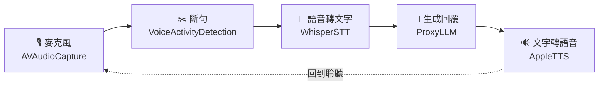
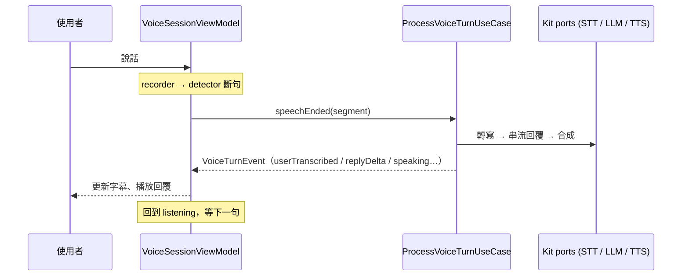

# AI Assistant POC — 智能語音助理

> 語言 · Language：**繁體中文** ｜ English（規劃中 / planned，將以 `README.en.md` 對應）

一個以 **Clean Architecture + SwiftUI** 打造的 iOS 智能助理 POC。目前的能力是「說話進、語音出」的即時語音對話：麥克風收音 → 偵測你何時說完 → 轉成文字 → 交給 LLM 生成回覆 → 念出來。

定位上它是一個**智能助理（intelligent assistant）**，語音只是現階段的第一種輸入。整個系統刻意切成可替換的模組，讓未來能接上人臉感知、自由麥克風、插話打斷等更貼近「助理」的互動方式（見 [未來規劃](#未來規劃)）。

---

## 目錄

- [一分鐘理解](#一分鐘理解)
- [Demo](#demo)
- [功能特色](#功能特色)
- [模組與職責總覽](#模組與職責總覽)
- [Main Target 架構設計](#main-target-架構設計)
- [技術選擇](#技術選擇)
- [安裝指南](#安裝指南)
- [效能分析](#效能分析)
- [未來規劃](#未來規劃)
- [已知限制](#已知限制)
- [文件導覽](#文件導覽)

---

## 一分鐘理解

一輪對話（turn）由五個階段串成，每個階段背後都是一個可獨立替換的模組：



- **App 端**只負責「組裝」與「畫面」，不含任何商業邏輯。
- **VoiceAgentKit**（本機 SPM 套件）裝著上面五個階段，每個 vendor 一個 target。
- **server/**：一支 FastAPI proxy，提供 Whisper 語音辨識與 LLM 串流。

> 💡 **核心概念：turn-based 對話**
> 
> - 對話輪次 (Turn)：指一次完整的「使用者輸入 → 系統回應」互動循環。
> - 現階段限制 (Half-duplex)：目前系統採用半雙工模式，即「助理說話時（TTS 播放中）關閉麥克風收音」，以避免硬體回音（Acoustic Echo）干擾判定。
> - 未來演進 (Full-duplex)：未來規劃引入[插話打斷](#3-插話打斷機制barge-in)機制 (Barge-in)，將音訊 Pipeline 升級為全雙工，允許邊播邊錄，提供更自然的即時互動體驗。

---

## Demo

▶ **[觀看 Demo 影片（Google Drive）](https://drive.google.com/file/d/1lZjHtpaoiNyDFpnfQeitfPOTfFvMj87a/view)**

影片流程：按下錄音 → 說話 → 即時字幕 → LLM 串流回覆 → 語音播放 → 回到聆聽，並從歷史訊息切回舊對話。

---

## 功能特色

| 功能 | 說明 |
| --- | --- |
| 即時語音對話 | 自動偵測語句結束（VAD endpointing），不需手動按結束 |
| 串流回覆 | LLM 以 SSE 逐字回傳，畫面即時長出文字，不用等整段生成 |
| 即時逐字稿與波形 | 收音時顯示音量波形（RMS），對話即時上字幕 |
| 對話歷史 | 以 SwiftData 保存多個對話 session，可隨時切回繼續 |
| 雙語 | 介面與語音支援英文、繁體中文，TTS 自動依內容選語言與嗓音 |
| 純抽象的 Presentation | 畫面與 ViewModel 只依賴 Domain protocol，可整條 mock 出來預覽 |

---

## 模組與職責總覽

為了實踐嚴格的 Clean Architecture，本專案把**可重用的語音基礎設施**（抽象 ports 與各 vendor 實作）放進本機 SPM 套件 (`VoiceAgentKit`)；App Main Target 則承載 **Composition Root**、**Presentation**，以及應用自身的 **Domain 層（Use Cases + Repository）**。

| Module | Role / Layer | Responsibility | Links |
| --- | --- | --- | --- |
| **AIAssistantPOC**（Main Target） | Presentation + App Domain + Composition Root | SwiftUI 畫面、`@Observable` ViewModel、狀態機；**Use Cases + Repository**（一輪對話的業務邏輯）；組裝並注入所有依賴 | [Main Target 架構設計](#main-target-架構設計) |
| **VoiceAgentDomain** | Ports + Entities（純 Swift） | STT/LLM/TTS/錄音/VAD 的抽象 ports 與 Entity，是 Use Case 依賴的 gateway；零框架依賴 | [Module_VoiceAgentDomain](docs/Module_VoiceAgentDomain.md) |
| **AVAudioCapture** | Data／音訊硬體 | 麥克風擷取、降採樣到 16kHz、產生 `AudioFrame` 串流 | [Module_AVAudioCapture](docs/Module_AVAudioCapture.md) |
| **VoiceActivityDetection** | Data／斷句邏輯 | 把連續音訊切成「一句完整的話」（endpointing），中立純邏輯 | [Module_VoiceActivityDetection](docs/Module_VoiceActivityDetection.md) |
| **SileroVAD** | Data／模型推論 | Silero v5（ONNX）逐窗打語音機率，供斷句引擎使用 | [Module_SileroVAD](docs/Module_SileroVAD.md) |
| **WhisperSTT** | Data／網路 | 語音轉文字：封 WAV、上傳自架 Whisper、回 `Transcription` | [Module_WhisperSTT](docs/Module_WhisperSTT.md) |
| **ProxyLLM** | Data／網路 | LLM 對話：SSE 串流逐字回覆，金鑰留在伺服器 | [Module_ProxyLLM](docs/Module_ProxyLLM.md) |
| **AppleTTS** | Data／音訊輸出 | 文字轉語音：偵測語言、選嗓音、on-device 播放 | [Module_AppleTTS](docs/Module_AppleTTS.md) |
| **server/** | Backend | FastAPI proxy：Whisper 辨識 + LLM 串流、rate limit | [API 整合方式](docs/API_Integration.md) |

> 上表的 Data 列皆為 VoiceAgentKit（本機 SPM 套件）的 per-vendor target，每個都只依賴 `VoiceAgentDomain`，可獨立抽換。完整依賴圖見 [系統架構](docs/Architecture.md)。

---

## Main Target 架構設計

> 這一節聚焦 **App Target（`AIAssistantPOC/`）** 本身。模組內部與跨模組依賴細節見 [系統架構](docs/Architecture.md)。

App target 扮演三個角色：**Composition Root**、**Presentation（畫面與狀態）**，以及應用自身的 **Domain 層（Use Cases + Repository Interface）**。所有「怎麼錄音、怎麼斷句、怎麼辨識」的 vendor 細節都在 VoiceAgentKit，App 端看不到、也不該看到。

### 分層

```
AIAssistantPOC/
├── App/                      # Composition Root：組裝依賴、注入 ViewModel
│   ├── AIAssistantPOCApp.swift    # @main，唯一 import 具體模組的地方
│   └── RootView.swift             # 畫面骨架 + 側選單
├── Shared/Domain/            # App 層共用 Entity 與介面（ChatMessage / ChatSession / ChatTranscriptRepository…）
└── Features/
    ├── Live/                 # 即時語音對話
    │   ├── Domain/
    │   │   ├── UseCases/          # ProcessVoiceTurn / GenerateReply / Transcribe…（業務邏輯）
    │   │   └── Repositories/      # ConversationRepository（介面）
    │   ├── Data/                  # InMemoryConversationRepository（Repository 實作）
    │   ├── Presentation/          # VoiceSessionViewModel、SessionState、Views
    │   └── Preview/               # 全套 mock，供 SwiftUI Preview 使用
    └── ChatHistory/          # 對話歷史（SwiftData）
        ├── Domain/                # ChatSessionRead/WriteRepository（介面）、Fetch/Delete/Load…UseCase
        ├── Data/                  # SwiftDataChatStore、ChatTranscriptRecorder（實作）
        ├── Presentation/  
        └── Preview/
```

> 💡 **核心概念：介面在 Domain、實作在 Data**：
> 
> 每個 feature 的 `Domain/Repositories/` 只放 Repository protocol，具體實作（SwiftData、in-memory…）一律落在同 feature 的 `Data/`。命名上「自家資料持久化」用 `Repository` 後綴，「對外部系統/裝置說話」的 gateway（STT/LLM/TTS/麥克風）維持 gerund 並住在 Kit。完整規範見 `CLAUDE.md` §3.4–3.6。

> 💡 **核心概念：Composition Root**
> 
> 整個 App 只有一個地方知道「哪個 protocol 要用哪個實作」——就是 `AIAssistantPOCApp`。它把 `AudioEngineRecorder`、`SileroVAD`、`WhisperSpeechRecognizer`… 這些具體實作組好，透過protocol 型別注入 ViewModel。其餘檔案只 `import VoiceAgentDomain`，看到的全是抽象。要換掉任何一塊（例如改用 on-device STT），只改這一個檔案。

### 核心：`VoiceSessionViewModel` 如何編排一輪對話

`VoiceSessionViewModel`（`@MainActor @Observable`）負責**擷取迴圈與狀態機**，把「一段完整語句」交給 Use Case 處理。它**只依賴 Use Case protocol**（外加 recorder/detector 兩個擷取 ports），不認得任何 vendor、也不直接碰 STT/LLM/TTS/Repository：

```swift
init(
    recorder: any AudioRecording,                 // 麥克風（擷取 port）
    detector: any VoiceActivityDetecting,         // 斷句（擷取 port）
    processTurn: any ProcessVoiceTurnUseCase,     // 一輪對話的業務邏輯
    startNew: any StartNewConversationUseCase,    // 開新對話
    resume: any ResumeConversationUseCase         // 還原歷史對話
)
```

一輪對話的資料流（業務邏輯收斂在 `ProcessVoiceTurnUseCase`，VM 只把回傳的 `VoiceTurnEvent` 映射成 state 與 messages）：



對應 `state` 的流轉：`idle → listening → speaking → processing → responding → playing → listening …`。完整狀態機見 [docs/State_Machine.md](docs/State_Machine.md)。

### App 的 Domain 層：Use Cases 與 Repository

業務邏輯收斂在 App 的 Domain 層（`Features/Live/Domain/`），每個 **Use Case** 都是「Protocol + Interactor 實作」，動詞命名，依賴 Kit 的 ports 與 App 的 Repository：

- **`ProcessVoiceTurnUseCase`**（核心編排）：吃一段語句，依序轉寫 → 串流回覆 → 持久化 → 合成，回傳 `VoiceTurnEvent` 串流。原本散在 ViewModel 的「一輪對話」業務邏輯全收進這裡。
- **`GenerateReplyUseCase`**：組 `system prompt + 歷史 + user`，串流 LLM，完成後把這輪寫回 Repository。
- **`TranscribeUtteranceUseCase`**：把「語音 → 文字」包成單一步驟（包裝 `SpeechRecognizing`）。
- **`StartNewConversationUseCase` / `ResumeConversationUseCase`**：對話生命週期（重置 / 還原歷史）。

對應的 **Repository**（介面在 `Domain/Repositories/`，實作在 `Data/`）：

- **`ConversationRepository`**（介面，Domain）→ 由 **`InMemoryConversationRepository`**（`actor`，Data）實作：純對話歷史存取，含滑動視窗截斷（預設保留最近 12 則）。LLM 串流不再混在這裡——歷史是「資料」，呼叫模型是 Use Case 的事。

ChatHistory 功能同樣遵循這套：`ChatSessionReadRepository` / `ChatSessionWriteRepository`（介面）由 `SwiftDataChatStore` 實作，並透過 `FetchSessionSummariesUseCase` / `DeleteSessionUseCase` / `LoadSessionUseCase` 讓 `SessionListViewModel`、`RootView` 不直接碰 Repository。

> 💡 **核心概念：UseCase / Repository / Domain 的分工**
> 
> **Repository** 管「資料怎麼存取」（介面在 Domain、實作在 Data），**Use Case** 管「一件業務怎麼完成」（協調 ports 與 repository，protocol＋interactor 都在 Domain），**ViewModel** 只依賴 Use Case protocol、把結果映射成畫面狀態。這是 Clean Architecture 的 **DIP（依賴反轉）**：高層不依賴低層，雙方都依賴中間的 protocol，因此每一層都能注入 mock 獨立測試。

### Presentation 的純粹性

- View 是「笨」的：只把 `SessionState` 這種語意狀態映射成 `LocalizedStringKey`（見 `SessionState+Presentation.swift`），自己不含商業邏輯。
- ViewModel **只暴露語意狀態，不暴露已翻譯字串**，讓 Presentation 邏輯可測試且與語言無關。
- `Features/*/Preview/` 提供整套 mock，SwiftUI Preview 不碰真實硬體與網路。

---

## 技術選擇

| 領域 | 選擇 | 理由 |
| --- | --- | --- |
| UI | SwiftUI + `@Observable` | iOS 26 起的現代狀態管理，少樣板、與 Swift Concurrency 契合 |
| 架構 | Clean Architecture + MVVM | Domain 零框架依賴，邏輯可獨立測試、可替換 vendor |
| 模組化 | 本機 SPM 多 target（per-vendor） | 每個外部依賴（音訊、VAD、STT、LLM、TTS）獨立隔離，可單獨抽換 |
| 並行 | Swift Concurrency（`async/await`、`actor`） | 全面禁用 `DispatchQueue` 與 completion handler；以 `actor` 保護共享狀態 |
| 並行安全 | Kit 全 target 採 Swift 6 strict concurrency | 編譯期杜絕 data race；App target 為 Swift 5 + MainActor-by-default |
| 斷句 VAD | Silero VAD v5（ONNX Runtime） | 業界常用的輕量神經網路 VAD，比能量門檻更耐噪 |
| 語音辨識 | 自架 faster-whisper（HTTP） | POC 期把重模型放伺服器；之後可換 on-device |
| LLM | 自架 FastAPI proxy（SSE 串流） | 把 provider 金鑰與選型留在伺服器，client 不持有金鑰 |
| 語音合成 | Apple `AVSpeechSynthesizer` | on-device、零延遲、免費、支援中英嗓音 |
| 持久化 | SwiftData（`@ModelActor`） | iOS 原生 ORM，actor 隔離確保執行緒安全 |

> 💡 **核心概念：ONNX**
> 
> ONNX 是一種跨框架的神經網路模型交換格式。Silero 官方提供 `.onnx` 權重，透過 Microsoft 的 ONNX Runtime 就能在 iOS 上直接推論，不必綁定特定訓練框架。

各 target 的職責與 `import` 邊界由 `CLAUDE.md` 與 [docs/Architecture.md](docs/Architecture.md) 規範。

---

## 安裝指南

### 需求

- Xcode 26、iOS 26.0+（實機或模擬器；麥克風建議用實機）
- Python 3.10+（執行 STT / LLM 伺服器）
- 一把 LLM provider 的 API key（預設 OpenAI）

### 1. 啟動伺服器

```bash
cd server
pip install -r requirements.txt
cp .env.example .env          # 填入 OPENAI_API_KEY，其餘可留預設
python server.py              # 監聽 0.0.0.0:8000
```

伺服器提供 `POST /api/v1/stt`（語音轉文字）與 `POST /api/v1/chat`（LLM SSE 串流），詳見 [docs/API_Integration.md](docs/API_Integration.md)。

### 2. 指向你的伺服器

App 目前為 demo 在程式內硬編伺服器位址。查出你 Mac 的區網 IP，改 `AIAssistantPOCApp.swift`：

```bash
ipconfig getifaddr en0        # 或 en1，依你的網路介面
```

```swift
// AIAssistantPOC/App/AIAssistantPOCApp.swift
private static let serverBaseURL = URL(string: "http://192.168.0.35:8000")!
```

> 區網明文 HTTP 已由 `Config/Info.plist` 的 `NSAllowsLocalNetworking` 與 `NSLocalNetworkUsageDescription` 放行。

### 3. 執行 App

用 Xcode 開啟 `AIAssistantPOC.xcodeproj`，選好 target 後執行。首次會請求麥克風與區網權限。

### 4. 跑測試

```bash
# VoiceAgentKit 單元測試（Swift Testing）
cd VoiceAgentKit && swift test
# App 層測試請用 Xcode 的 Test（⌘U）
```

---

## 效能分析

> 📊 **Baseline（模擬器 → 本機 server，非實機）**
> 
> 以 opt-in benchmark 量得（n=20）。量測方法、條件與目標值見 **[效能量測指南](docs/Performance.md)**；程式內並埋有 `OSSignposter`（subsystem `AIAssistantPOC` / category `Performance`）供 Instruments 在實機上量。

各階段延遲（量測點對應 `ProcessVoiceTurnInteractor` 的 signpost 事件）：

| 區段 | signpost 量測點 | p50 | p90 | p95 |
| --- | --- | --- | --- | --- |
| 斷句延遲 | `speechEnded` 相對實際說完 | 設計值 `minSilenceDurationMs` 700ms | — | — |
| STT 往返（4.7s 語料） | `VoiceTurn` 起點 → `STT.done` | 1915ms | 2015ms | 2041ms（RTF 0.41）|
| LLM 首字（TTFT） | `STT.done` → `LLM.firstToken` | 677ms | 862ms | 1161ms |
| LLM 全文 | `LLM.firstToken` → `LLM.complete` | 825ms | 1130ms | 1452ms |
| TTS 起播 | `TTS.begin` → 出聲 | 待實機量測 | — | — |

> 條件：iPhone 17 模擬器、faster-whisper `small`（CPU、beam_size=5）、LLM proxy 走本機 loopback。實機 + Wi-Fi 的數字會不同。STT 是目前主要瓶頸。

**觀察到的瓶頸**：目前 `ProcessVoiceTurnInteractor` 等 LLM **全文**生成完才開始 TTS，所以 SSE 串流只加速了「字幕」，「聲音」仍要等 STT + LLM 全文。長回覆時延遲會放大——可改**逐句 TTS**（先念第一句、邊念邊生成）。詳見 [效能量測指南](docs/Performance.md)。

已落實的優化方向：

- **降採樣優先用 FIR 整數抽取**：硬體取樣率與 16kHz 成整數倍時走 `vDSP` 加速的 FIR decimation，否則退回 `AVAudioConverter`。詳見 [docs/Audio_Pipeline.md](docs/Audio_Pipeline.md)。
- **SSE 串流先回首字**：LLM 邊生成邊上字幕與後續播放，降低「感知延遲」。
- **on-device TTS**：合成不走網路，起播延遲僅受嗓音資源影響。
- **滑動視窗對話歷史**：`ConversationRepository` 截斷舊訊息，控制每次 LLM 請求的 token 量。

**測試覆蓋**：VoiceAgentKit 含 21 個測試 suite、約 89 個測試案例，涵蓋 Domain、各 vendor 模組與斷句邏輯（Swift Testing）。

---

## 未來規劃

> 以下為**尚未實作**的功能，先定義概念與未來在現有架構上的實作方式——從互動模式（在場感知、連續對話、可打斷）到助理能力（工具調用）逐步擴充。

### 1. 人臉辨識觸發（Presence-Triggered Listening）

**概念**：偵測到有人出現在鏡頭前就自動開始收音，人離開即停止；支援多人臉場景（例如只在「有人面向裝置」時啟動）。讓助理像櫃檯一樣「看到人就接待」，免去手動開關。

**未來實作**：
- 在 `VoiceAgentDomain` 新增 `PresenceDetecting` protocol（輸出 `presenceChanged(faces:)` 之類事件），維持 Domain 零框架。
- 偵測引擎可二選一，各自獨立 target、由 Composition Root 注入（換引擎不動上層）：
  - **`VisionFaceDetection`**：Apple **Vision**（`VNDetectFaceRectanglesRequest`），原生、零第三方依賴，多人臉回傳多個 bounding box。
  - **`MLKitFaceDetection`**：Google **ML Kit Face Detection**，on-device、跨平台，內建臉部追蹤（tracking ID 可跨影格認出同一個人，多人場景很實用）與表情/睜眼分類；代價是引入第三方 SDK（iOS 主要走 CocoaPods、binary 較大）。
- 由 Composition Root 注入，`VoiceSessionViewModel` 訂閱 presence 事件來驅動 `start()` / `stop()`，與現有麥克風生命週期接合。
- 多人場景策略（最近的人 / 正面朝向 / 主講者）留在 detector 內，可獨立調整與測試。

> 💡 **核心概念：on-device 人臉偵測（Vision / ML Kit）**
> 
> 兩者都在裝置上即時偵測人臉、隱私資料不離開裝置，差別在 Vision 是原生零依賴、ML Kit 跨平台且功能更多（如臉部追蹤 tracking ID）。因為上層只依賴 `PresenceDetecting` protocol，選哪個、之後要不要換，都只動 Composition Root。

### 2. 自由麥克風（Free Microphone / 連續對話模式）

**概念**：提供一個手動開關，開啟後麥克風**持續收音**，使用者可以一直說、多輪連續對話不必每輪重啟；此模式下 VAD 持續運作做斷句，並支援被[打斷](#3-插話打斷機制barge-in)。

**未來實作**：
- `SessionState` 增加「連續模式」維度（或新增 `CaptureMode { pushToggle, continuous }`），決定一輪結束後是回 `idle` 還是自動回 `listening`。
- 現有 `SpeechEndpointDetector` 已是串流式、reset 後可重複斷句，連續模式下不在每輪 `stop()` 錄音，只重置 detector 狀態即可。
- UI 增加常駐的模式切換；播放回覆時麥克風保持開啟，銜接打斷機制。

### 3. 插話打斷機制（Barge-in）

**概念**：當助理正在說話時，使用者可隨時插話打斷——立即停止 TTS 播放，並讓新的一句**銜接既有上下文**繼續對話，而非從頭開始。這是最接近真人對話的互動。

**未來實作**：
- 音訊改為**全雙工**：`playAndRecord` 下播放 TTS 的同時持續收音，並倚賴 voice processing 的**回聲消除（AEC）**避免把自己的聲音當成使用者輸入。
- 在 `playing` 狀態仍運行 VAD；一旦偵測到 `speechStarted`，呼叫 `synthesizer.stop()` 並取消當前 turn 的 `Task`。
- 上下文銜接天然成立：`ConversationRepository`（`actor`）保有對話歷史，打斷只是提早結束這一輪、開啟新一輪，歷史不丟。
- 需處理「已念出的部分」是否寫回歷史的策略（完整回覆 vs. 實際播放到的位置）。

> 💡 **核心概念：AEC（Acoustic Echo Cancellation，回聲消除）**
> 
> 全雙工最大的難題是麥克風會收到喇叭播出的聲音。AEC 會從輸入訊號中減去已知的播放訊號，避免助理「聽到自己」而誤判使用者開口。`AVAudioEngine` 的 `setVoiceProcessingEnabled(true)` 已啟用此能力。

### 4. App Attest 裝置驗證（防止 LLM 被濫用）

**概念**：智能助理的 LLM 端點是金錢成本所在，一旦端點外流就可能被腳本盜刷。導入 Apple **App Attest**，讓伺服器只接受「來自貨真價實、未被竄改的本 App」的請求，把爬蟲與盜用的假 client 擋在門外。

**未來實作**：
- App 端首次啟動以 `DCAppAttestService` 產生一組硬體支持的金鑰，向 Apple 取得 attestation，再交給伺服器註冊。
- 之後每次呼叫 `/api/v1/chat` 都附上 assertion（對請求內容簽章）；伺服器向 Apple 驗證通過才放行。
- 對接現有的 `LLMConfiguration.accessToken` 預留欄位：把短期 token 換成 App Attest 簽章，與既有 rate limit 疊加防護。
- 驗證屬伺服器端職責，client 模組（[ProxyLLM](docs/Module_ProxyLLM.md)）只多帶一個 header，維持無狀態。

> 💡 **核心概念：App Attest 與裝置完整性驗證**
> 
> App Attest 用裝置上的 Secure Enclave 產生無法被複製的金鑰，向 Apple 證明「這個請求確實來自我發布、且未被竄改或越獄環境下的 App」。它不是驗證「使用者是誰」，而是驗證「client 是不是真貨」，常用來保護高成本或易被濫用的後端 API。

### 5. 工具調用（Tool Calling），讓助理能「做事」

**概念**：目前助理只能「用對話內容回答」。導入 **tool calling**（function calling）後，LLM 可在需要時回傳「要呼叫哪個工具 + 參數」，由 app 執行該工具（本地端或後端），把結果回灌給 LLM 再產生最終回覆。助理就從「會聊天」升級成「會查資料、會做事」。例如：

- **本地端資訊**（在裝置上、隱私不外流）：查通訊錄（「打給媽媽」「小明的電話」）、行事曆／提醒（「明天九點提醒我開會」）、定位、裝置設定。
- **後端能力**：網頁搜尋（讓伺服器代打搜尋 API，回最新資訊），以及其他需要金鑰的服務（金鑰留在伺服器）。

**未來實作**：
- **Domain**：新增 `Tool` 抽象——每個工具一個 protocol（gateway），如 `ContactsReading`（查通訊錄）、`ReminderWriting`（建提醒）、`WebSearching`（後端搜尋），並定義工具 schema（名稱、參數）的 Entity。
- **LLM 邊界**：`LLMResponding` 與 server proxy 擴充成支援 tool-call 協定（OpenAI function calling）——串流回傳可能是「文字 delta」或「tool call（工具名 + JSON 參數）」。
- **編排**：`ProcessVoiceTurnUseCase` 的回覆流程改成 tool-call 迴圈：LLM →（要呼叫工具）→ 執行對應工具 → 把結果當一則 message 回灌 → LLM 收斂成最終回覆（多數情況一兩輪即結束）。
- **本地工具**：各自獨立 target／gateway 實作（如以 `Contacts`、`EventKit` 包成 `ContactsReading`、`ReminderWriting`），與現有 per-vendor 模組一致，並補對應權限（`NSContactsUsageDescription` 等）。
- **後端工具**（網頁搜尋）：放伺服器執行，沿用 proxy 模式把搜尋 API 金鑰留在後端。

> 💡 **核心概念：Tool Calling（function calling）**
> 
> LLM 本身不會真的執行動作，它只「決定要呼叫哪個工具、給什麼參數」；實際執行與安全把關都在你的 app／後端，結果再交回 LLM 收斂成自然語言。這讓助理能碰即時、私有、或有副作用的能力，同時把「能做什麼」嚴格限制在你提供的工具集合內。

---

## 已知限制

| 限制 | 說明 / 未來方向 |
| --- | --- |
| 伺服器位址硬編 | demo 用，正式版應移到設定或服務發現 |
| 伺服器無認證 | proxy 僅有 rate limit，設定已預留 `accessToken`；待[App Attest](#4-app-attest-裝置驗證防止-llm-被濫用)接入 |
| Whisper 跑 CPU | `int8` 量化的 small 模型於 CPU 推論，延遲受限；可換 GPU 或 on-device |
| 嚴格輪流（half-duplex） | 助理說話時不收音；待[插話打斷](#3-插話打斷機制barge-in)實作 |
| 單一語言播報 | 一段回覆用單一嗓音念，混語句子由該嗓音概括處理 |
| 明文 HTTP | 僅供區網；對外需 TLS |
| SwiftUI Previews 不可用 | App target 連結了 `onnxruntime`（binary framework，經 `SileroVAD`），Xcode 的 JIT preview executor 載入它會在啟動時 SIGTRAP，導致**此 target 任何 view 的 preview 都無法啟動**（正常 `⌘R`／測試不受影響）。UI 開發暫以執行 app 進行。根治需把 Presentation 抽成只依賴 `VoiceAgentDomain` 的獨立 SPM 模組 |
| Local Network 權限 | 首次安裝連 LAN server（STT/LLM）會觸發 iOS Local Network 權限框，且觸發當下那個請求會被系統擋掉。已緩解：啟動時先暖身連一次 server 把權限框提早跳出（`WarmUpServerConnectionUseCase`），STT 並對 transport 錯誤自動重試一次。正式版改用有 DNS 名稱的雲端 HTTPS 端點即無此關卡 |

---

## 文件導覽

### 跨領域主題

- [系統架構與模組依賴](docs/Architecture.md) — Clean Architecture 分層、DIP、模組依賴圖
- [API 整合方式](docs/API_Integration.md) — 伺服器端點、SSE 協定、client 串接
- [音訊處理流程](docs/Audio_Pipeline.md) — 擷取 → 降採樣 → 斷句的完整流程與核心概念
- [狀態機設計](docs/State_Machine.md) — `SessionState` 流轉與 turn 生命週期
- [錯誤處理](docs/Error_Handling.md) — 各層錯誤型別、failure 狀態與 fallback
- [效能量測指南](docs/Performance.md) — signpost 埋點、opt-in benchmark、伺服器計時與目標值

### 模組（VoiceAgentKit）

- [VoiceAgentDomain](docs/Module_VoiceAgentDomain.md) — 純 Swift Domain：protocol 與 Entity
- [AVAudioCapture](docs/Module_AVAudioCapture.md) — 麥克風擷取與降採樣
- [VoiceActivityDetection](docs/Module_VoiceActivityDetection.md) — 斷句引擎（endpointing）
- [SileroVAD](docs/Module_SileroVAD.md) — ONNX 語音機率打分器
- [WhisperSTT](docs/Module_WhisperSTT.md) — 語音轉文字 networking
- [ProxyLLM](docs/Module_ProxyLLM.md) — LLM SSE 串流 networking
- [AppleTTS](docs/Module_AppleTTS.md) — 文字轉語音與語言偵測
