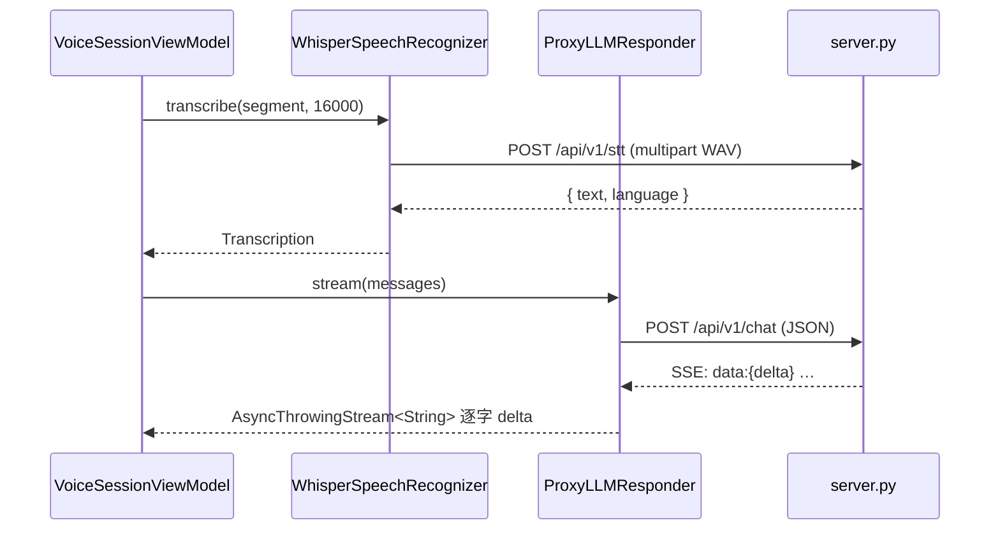

# API 整合方式

> 語言 · Language：**繁體中文** ｜ English（規劃中 / planned）
>
> 上層導覽：[README](../README.md)

智能助理的兩個重模型——語音辨識（STT）與大型語言模型（LLM）——目前放在一支自架的 **FastAPI proxy**（`server/server.py`）。本頁說明端點合約、SSE 串流格式，以及 client 端如何串接。

> 💡 **核心概念：為什麼要 proxy？**
> 
> 把 provider 的 API key 與模型選型留在伺服器，client 永遠不持有金鑰。要換 LLM provider 或 Whisper 模型，只改伺服器，App 不必改版送審。這也是 [ProxyLLM 模組](Module_ProxyLLM.md)命名的由來。

---

## 端點總覽

| 端點 | 方法 | 用途 | 回應型態 |
| --- | --- | --- | --- |
| `/api/v1/stt` | POST | 語音轉文字 | `application/json` |
| `/api/v1/chat` | POST | LLM 對話 | `text/event-stream`（SSE） |

Base URL 由 client 注入（`WhisperConfiguration` / `LLMConfiguration` 的 `baseURL`），demo 預設 `http://192.168.0.35:8000`。

---

## STT 端點 POST /api/v1/stt

**請求**：`multipart/form-data`，欄位 `file` 帶一個 16-bit PCM WAV。

client 端由 [WhisperSTT](Module_WhisperSTT.md) 負責：先用 `WAVEncoder` 把 16kHz Float32 樣本封成 WAV，再組 multipart body 上傳。

**回應**：

```json
{ "text": "辨識出的文字", "language": "zh" }
```

伺服器以 `faster-whisper`（預設 `small` 模型、`int8` 量化、CPU）轉寫，並開啟 `vad_filter` 過濾靜音。

> 💡 **核心概念：beam search（`beam_size=5`）**
> 
> 解碼時不只挑每一步機率最高的字，而是同時保留 5 條候選路徑、最後選整體最佳，辨識更穩，代價是稍慢。

---

## LLM 端點 POST /api/v1/chat

**請求**：`application/json`

```json
{
  "messages": [
    { "role": "system",    "content": "You are a concise, friendly voice assistant…" },
    { "role": "user",      "content": "今天天氣如何？" },
    { "role": "assistant", "content": "我無法查即時天氣…" },
    { "role": "user",      "content": "那幫我設個提醒" }
  ]
}
```

訊息由 [`GenerateReplyUseCase`](../README.md#app-的-domain-層use-cases-與-repository) 組好（system prompt + `ConversationRepository` 的歷史 + 最新 user turn），交給 [ProxyLLM](Module_ProxyLLM.md) 編碼送出。

**回應**：`text/event-stream`，逐塊回傳生成文字。

```
data: {"delta": "我"}

data: {"delta": "可以"}

data: {"delta": "幫你"}

data: [DONE]
```

錯誤則為 `data: {"error": "..."}`。

> 💡 **核心概念：SSE（Server-Sent Events）**
> 
> 一種伺服器單向持續推送的 HTTP 串流，每筆事件是一行 `data: ...`、以空行分隔。比起等整段 JSON 生成完才回，SSE 能「邊生成邊吐字」，大幅降低使用者感受到的延遲。client 端的解析在 `SSELineParser`。

### 伺服器端保護

| 機制 | 預設 | 環境變數 |
| --- | --- | --- |
| Rate limit | 每 IP 60 秒 30 次 | `LLM_RATE_LIMIT` |
| 最大訊息數 | 40 | `LLM_MAX_MESSAGES` |
| 最大總字元 | 8000 | `LLM_MAX_CHARS` |
| 最大生成 token | 512 | `LLM_MAX_TOKENS` |

超限分別回 `429`、`413`。

---

## Client 端串接流程




兩個 client 模組都是**無狀態、`Sendable`、純 networking**：不碰 UI、不碰 `AVFoundation`，輸入輸出皆為 Domain 型別。錯誤對應見 [錯誤處理](Error_Handling.md)。

---

## 伺服器設定

```bash
cd server
pip install -r requirements.txt
cp .env.example .env
python server.py
```

`.env` 主要欄位：

```
OPENAI_API_KEY=        # 你的 provider key
LLM_PROVIDER=openai
LLM_MODEL=gpt-4o-mini
WHISPER_MODEL=small    # tiny / base / small / medium / large
```

---

## 相關文件

- [WhisperSTT 模組](Module_WhisperSTT.md)
- [ProxyLLM 模組](Module_ProxyLLM.md)
- [錯誤處理](Error_Handling.md)
