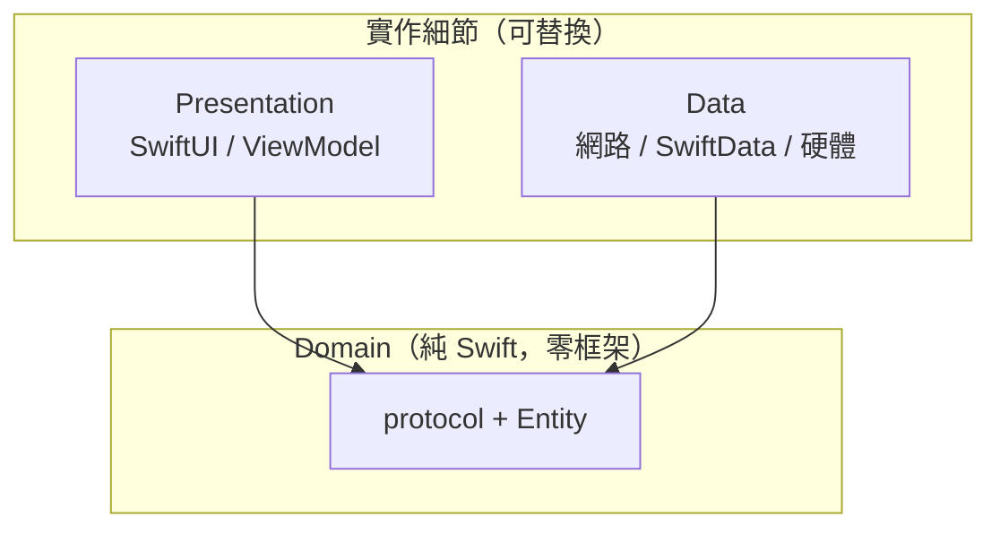
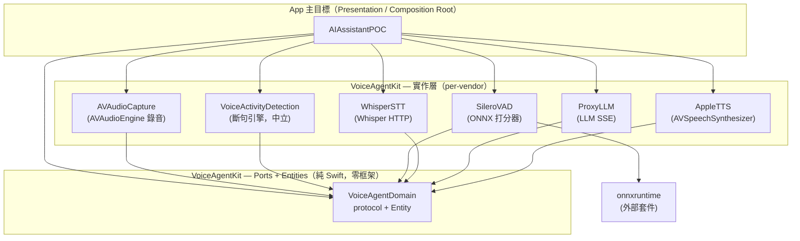

# 系統架構與模組依賴

> 語言 · Language：**繁體中文** ｜ English（規劃中 / planned）
>
> 上層導覽：[README](../README.md)

本頁說明整個專案的 Clean Architecture 分層、模組依賴方向，以及背後的 DIP（依賴反轉）原則。App target 自身的設計見 README 的 [Main Target 架構設計](../README.md#main-target-架構設計)。

---

## 為什麼這樣分層

智能助理要長期演進——換掉 STT、加上人臉觸發、把雲端模型換成 on-device——關鍵在於**讓「邏輯」與「實作細節」彼此不知道對方存在**。做法是 Clean Architecture：依賴只能往內流，最內層是不依賴任何框架的 Domain。

> 💡 **核心概念：DIP（Dependency Inversion Principle，依賴反轉）**
> 
> 「高層模組不應依賴低層模組，兩者都應依賴抽象。」傳統上畫面會直接呼叫網路程式碼（高層依賴低層）；反轉之後，雙方都依賴中間的 protocol。於是低層（網路）變成「可插拔的實作」，換掉它不影響高層。

---

## 模組依賴圖

> 來源：`VoiceAgentKit/Package.swift` 與 App target 的實際 `import` 宣告。

兩個關鍵觀察：

1. **箭頭全部指向 `VoiceAgentDomain`。** Domain 不依賴任何人，所有實作模組依賴它。這就是 DIP 的具體實踐。
2. **App 是唯一連到具體 vendor 模組的節點**（Composition Root）。App 內部其餘檔案（ViewModel / Pipeline / Preview）只 `import VoiceAgentDomain`。

> 💡 **核心概念：per-vendor 模組切分**
> 
> 斷句引擎 `VoiceActivityDetection` 只依賴 Domain 的 `SpeechProbabilityScoring` protocol；真正的打分器 `SileroVAD`（綁 ONNX）由 App 在組裝時注入。兩個模組彼此沒有直接依賴——所以要把 Silero 換成別的 VAD 模型，斷句邏輯一行都不用動。

---

## 三層職責對照

| 層 | 位置 | 職責 | 可依賴 |
| --- | --- | --- | --- |
| **Domain** | Kit `VoiceAgentDomain`（Ports + Entities）＋ App `Features/*/Domain`（Use Cases + Repository + Entities） | 抽象 ports、Entity、業務邏輯（Use Case）、資料存取契約（Repository） | 僅 `Foundation`（+ Kit ports） |
| **Data** | Kit 各 vendor target、App `*/Data` | 實作 protocol、網路、硬體、DB | Domain + 各自框架 |
| **Presentation** | App `*/Presentation`、`App/` | View、ViewModel、組裝 | Domain（Composition Root 另可 import 具體模組） |

> 💡 **核心概念：兩處 Domain 的分工**
> 
> Kit 的 `VoiceAgentDomain` 是**可重用的語音 ports + entities**（gateway 抽象）；App 的 `Features/*/Domain` 才是**應用自身的 Domain**——`ProcessVoiceTurnUseCase` 等 Use Case 與 `ConversationRepository` 住在這裡，依賴 Kit ports 完成業務。換 vendor 只動 Kit，改業務只動 App。

> 💡 **核心概念：DTO 不外洩**
> 
> Data 層的 API 回應用 DTO（如 `STTResponseDTO`、`ChatChunkDTO`）承接，並在該層 `toDomain()` 映射成 Entity。DTO 永遠不進 Domain，避免 API 格式變動污染核心邏輯。

---

## 並行與資料安全邊界

- **VoiceAgentKit 全 target**：Swift 6 strict concurrency，編譯期杜絕 data race。
- **App target**：Swift 5 + MainActor-by-default；需離開主執行緒的型別明確標 `nonisolated`。
- 跨並行邊界傳遞的型別全部 `Sendable`（`AudioFrame`、`Transcription`、`LLMMessage`…）。
- 共享可變狀態以 `actor` 保護：`AudioEngineRecorder`、`SpeechEndpointDetector`、`SileroVAD`、`InMemoryConversationRepository`、`SwiftDataChatStore`（`@ModelActor`）。

> 💡 **核心概念：`actor` 與 `Sendable`**
> 
> `actor` 是 Swift 的並行型別，內部可變狀態一次只允許一個任務存取，天然避免 race condition。`Sendable` 是「可安全跨執行緒傳遞」的標記；編譯器會檢查跨 `await` 邊界的值是否都符合。

---

## 相關文件

- [音訊處理流程](Audio_Pipeline.md)
- [狀態機設計](State_Machine.md)
- [API 整合方式](API_Integration.md)
- [錯誤處理](Error_Handling.md)
- 各模組頁見 [README 文件導覽](../README.md#文件導覽)
