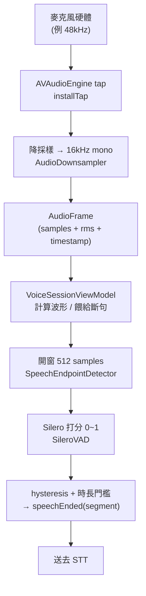

# 音訊處理流程

> 語言 · Language：**繁體中文** ｜ English（規劃中 / planned）
>
> 上層導覽：[README](../README.md)

從麥克風的原始類比訊號，到一段「可以送去辨識的完整語句」，中間經過擷取、降採樣、開窗、打分、斷句數個步驟。本頁把這條流程攤開，並補上新人需要的訊號處理核心概念。

---

## 全貌




模組對應：擷取/降採樣 → [AVAudioCapture](Module_AVAudioCapture.md)；斷句 → [VoiceActivityDetection](Module_VoiceActivityDetection.md)；打分 → [SileroVAD](Module_SileroVAD.md)。

---

## 1. 擷取（Capture）

`AudioEngineRecorder`（`actor`）在 `AVAudioEngine` 的 input node 裝一個 tap，硬體每湊滿一個 buffer 就回呼。音訊 session 設為 `.playAndRecord` / `.voiceChat`，並啟用 voice processing（含回聲消除與降噪），適合遠場與未來的全雙工。

> 💡 **核心概念：PCM 與取樣率（sample rate）**
> 麥克風把連續的聲波，每秒切成數萬個數值點記錄下來，這就是 PCM。每秒取幾點即「取樣率」，48000Hz 代表每秒 48000 個樣本。本案每個樣本是 `Float32`，範圍 `-1.0 ~ 1.0`。

---

## 2. 降採樣（Downsampling）到 16kHz

下游的 Whisper 與 Silero 都吃 **16kHz mono**，但硬體常給 44.1k/48k。`AudioDownsampler` 兩條路：

- **整數倍**（例 48k→16k＝3 倍）：走 `FIRDecimator`，以 `vDSP_desamp` 做 SIMD 加速的 FIR 低通＋抽取。
- **非整數倍**：退回 `AVAudioConverter`（最高品質 mastering 演算法）。

> 💡 **核心概念：為什麼降採樣前要低通濾波？（anti-aliasing）**
> 
> 直接「每 3 點取 1 點」會讓高於新取樣率一半（Nyquist 頻率，16k 的一半＝8kHz）的高頻「摺疊」成假的低頻雜訊，稱為 aliasing。所以要先用低通濾波器把高頻濾掉再抽取——這正是 FIR decimation 在做的事。

> 💡 **核心概念：FIR 濾波器**
> 
> FIR（有限脈衝響應）濾波器把輸入訊號與一組固定係數（taps）做加權平均。本案用 sinc × Hamming window 設計 127 taps 的低通，截止設在 `16k×0.45`，在 Nyquist 前留一點過渡帶。

---

## 3. 開窗與打分

斷句器把連續樣本切成**固定 512 點**的分析窗（16kHz 下約 32ms），逐窗交給 Silero 打一個「是語音的機率」（0~1）。

打分前會做**自適應正規化**：把過於乾淨但偏小聲的訊號放大到 Silero 慣用的能量範圍（目標 RMS 0.12，靜音地板以下不放大，增益上限 40 倍）。此放大**只影響打分**，輸出的語句樣本維持原始音量。

> 💡 **核心概念：RMS（Root-Mean-Square，均方根）**
> 
> 把一段樣本各自平方、取平均、再開根號，得到一個代表「整體音量大小」的數值。它比單看最大振幅穩定，常用來畫音量條（本案的波形）與判斷靜音。公式：`rms = sqrt(mean(sample²))`。

---

## 4. 斷句（Endpointing）

逐窗機率經過**雙門檻 hysteresis** 與**最短時長**，才決定語句的開始與結束：

- 機率 ≥ `speechThreshold`（0.5）且持續 ≥ `minSpeechDurationMs`（250ms）→ `speechStarted`。
- 機率 < `silenceThreshold`（0.35）且靜音累積 ≥ `minSilenceDurationMs`（700ms）→ `speechEnded(segment)`。
- 語句前緣保留 `speechPadMs`（150ms）的 leading pad，避免吃掉開頭的字。

> 💡 **核心概念：hysteresis（遲滯雙門檻）**
> 
> 用「進入」與「離開」兩個不同門檻，而非單一門檻。若只用一個門檻，訊號在臨界值上下抖動時會狂跳 on/off。雙門檻製造一個緩衝帶，狀態切換更穩——溫控器、施密特觸發器都是這個原理。

斷句邏輯的細節（狀態變數、leading pad、debounce）見 [VoiceActivityDetection 模組](Module_VoiceActivityDetection.md)。

---

## 串流如何在程式中流動

```
recorder.start() -> AsyncStream<AudioFrame>
        │  （ViewModel 取 rms 畫波形）
        ▼
sampleContinuation.yield(frame.samples)  // 只在 listening/speaking 餵
        ▼
detector.events(from:) -> AsyncStream<VADEvent>
        ▼
.speechStarted / .speechEnded(segment)
```

ViewModel 只在 `listening` / `speaking` 狀態餵樣本給斷句器；進入 `processing`/`responding`/`playing` 後停止餵入（目前 half-duplex 的關鍵）。未來[插話打斷](../README.md#3-插話打斷機制barge-in)會改成播放時仍持續餵入。

---

## 診斷探針（DEBUG）

`AudioProbe`（gated by `AudioProbe.isEnabled`）可在 DEBUG 下記錄 RMS 統計並把語句 dump 成 WAV，用來核對「實際送進 STT 的音檔」品質。正式版不會啟用。

---

## 相關文件

- [AVAudioCapture 模組](Module_AVAudioCapture.md)
- [VoiceActivityDetection 模組](Module_VoiceActivityDetection.md)
- [SileroVAD 模組](Module_SileroVAD.md)
- [狀態機設計](State_Machine.md)
