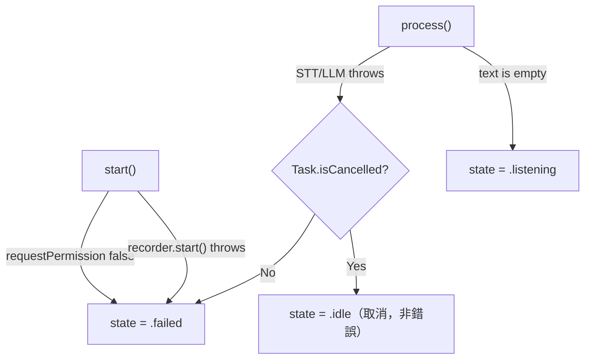

# 錯誤處理

> 語言 · Language：**繁體中文** ｜ English（規劃中 / planned）
>
> 上層導覽：[README](../README.md)

語音 pipeline 跨越硬體、網路、模型推論三種容易出錯的邊界。本頁整理各層的錯誤型別、它們如何收斂到 UI 的 `failed` 狀態，以及哪些情況選擇「優雅降級」而非報錯。

---

## 設計原則

1. **每層定義自己的型別化錯誤**（typed error），不靠字串或 `NSError` 猜測。
2. **錯誤往上拋，狀態在 ViewModel 收斂**：底層只拋 `throws`，由 `VoiceSessionViewModel` 決定轉成 `failed` 還是降級。
3. **可預期的缺失用降級，不用崩潰**：例如 VAD 模型載入失敗仍讓 App 起得來。
4. **取消不是錯誤**：使用者主動停止走 `idle`，不是 `failed`。

> 💡 **核心概念：typed throws / 型別化錯誤**
> 
> 每個邊界用專屬 enum（如 `SpeechRecognitionError`）列出所有失敗模式，呼叫端 `catch` 時能精準分流（伺服器錯 vs. 解碼錯 vs. 連線錯），而不是只拿到一個模糊的 error。

---

## 各層錯誤型別

| 來源 | 型別（`VoiceAgentDomain`） | 代表性 case |
| --- | --- | --- |
| 錄音 | `AudioRecorderError` | `permissionDenied`、`engineStartFailed`、`sessionConfigFailed` |
| STT | `SpeechRecognitionError` | `emptyAudio`、`server(status:)`、`transport`、`decoding`、`invalidResponse` |
| LLM | `LLMError` | `emptyConversation`、`server(status:)`、`transport`、`stream`、`decoding` |
| TTS | `TTSError` | `emptyText`、`cancelled`、`synthesisFailed` |
| VAD 打分 | `SileroVADError` | `modelNotFound`、`sessionCreationFailed`、`inferenceFailed`、`invalidWindowSize` |

每個型別都 `Sendable & Equatable`，方便在測試裡用 Given-When-Then 斷言特定失敗。

---

## 在 ViewModel 的收斂




關鍵片段：

```swift
} catch {
    if !Task.isCancelled { state = .failed }   // 取消不算失敗
}
```

`failed` 狀態在 View 被映射為本地化的 `status.failed` 文字（中英），ViewModel 本身不持有任何已翻譯字串。

---

## 優雅降級（Graceful Degradation）

有些「失敗」不該讓 App 停擺，而是退到一個仍可用的狀態：

| 情境 | 降級行為 | 程式位置 |
| --- | --- | --- |
| Silero 模型載入失敗 | 改用 `SilentScorer`（永遠回 0），App 照常啟動，只是不會自動斷句 | `AIAssistantPOCApp.makeDetector()` |
| SwiftData 持久化容器建立失敗 | 退回 in-memory 容器，當次能用、不寫入本地端 | `AIAssistantPOCApp.makeStore()` |
| STT 辨識結果為空字串 | 不送 LLM，直接回 `listening` 等下一句 | `VoiceSessionViewModel.process()` |
| 降採樣器建立失敗 | 拋 `engineStartFailed`，錄音不啟動 | `AudioEngineRecorder.start()` |

> 💡 **核心概念：fail-safe 預設**
> 
> `SilentScorer` 是一個「安全的空實作」——介面相同但什麼都不做。比起讓建構子 throw 把整個 App 拖垮，提供一個惰性替身能讓其餘功能存活，是穩健系統常見手法。

---

## 網路錯誤的分流

STT 與 LLM 的 networking 層把底層錯誤映射成語意明確的 case：

- 連線層失敗（逾時、斷線）→ `transport(String)`
- HTTP 非 2xx → `server(status: Int)`（對應伺服器的 `429` rate limit、`413` 過長）
- 回應非 `HTTPURLResponse` → `invalidResponse`
- JSON / SSE 解析失敗 → `decoding(String)` / `stream(String)`

伺服器端的限制（rate limit、訊息數、字元數）見 [API 整合方式](API_Integration.md#伺服器端保護)。

---

## 日誌

所有診斷以 `os.Logger` 記錄，**一律英文**（依專案規範，logs 不在地化）。各模組有獨立 logger：`VoiceLog`、`IntelligenceLog`、`STTLog`、`LLMLog`、`TTSLog`，並對隱私敏感欄位標註 `privacy`。

---

## 相關文件

- [API 整合方式](API_Integration.md)
- [狀態機設計](State_Machine.md)
- 各模組頁見 [README 文件導覽](../README.md#文件導覽)
