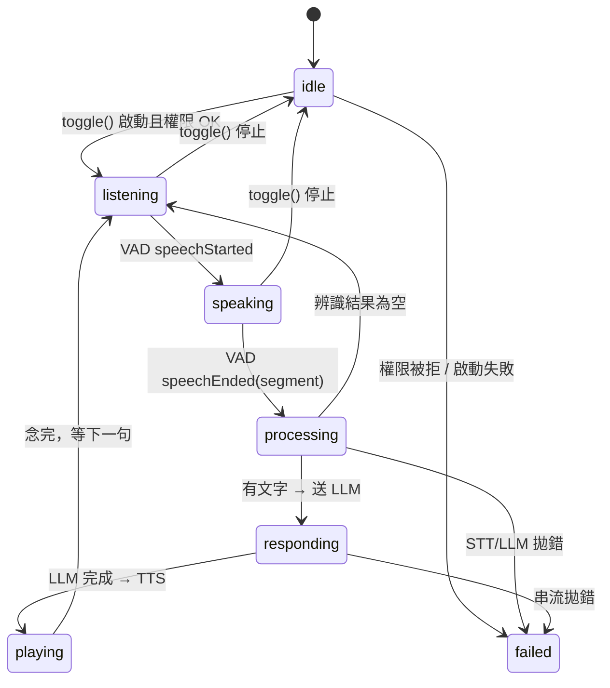

# 狀態機設計

> 語言 · Language：**繁體中文** ｜ English（規劃中 / planned）
>
> 上層導覽：[README](../README.md)

一輪對話會經過數個明確的階段。把這些階段建模成一個 enum 狀態機（`SessionState`），讓「現在在做什麼」變成單一可信來源——UI 拿它顯示文字與動畫，邏輯拿它決定要不要收音。

---

## 狀態定義

`SessionState`（`AIAssistantPOC/Features/Live/Presentation/SessionState.swift`）：

| 狀態 | 意義 | 是否收音 |
| --- | --- | --- |
| `idle` | 閒置，尚未開始 | 否 |
| `listening` | 已收音，等待使用者開口 | 是 |
| `speaking` | 偵測到使用者正在說話 | 是 |
| `processing` | 語句送 STT 辨識中 | 否 |
| `responding` | LLM 串流回覆中 | 否 |
| `playing` | TTS 念出回覆中 | 否 |
| `failed` | 發生錯誤 | 否 |

> 💡 **核心概念：為什麼用 enum 狀態機？**
> 
> 把「合法的狀態」窮舉成 enum，等於用型別把「不可能的狀態」擋在門外。配合 `switch` 編譯器會強制你處理每個 case，少了 `isLoading`、`isPlaying`、`hasError` 一堆布林彼此矛盾的可能。

---

## 流轉圖




注意 `processing → responding → playing → listening` 是**自動串接**的；只有 `idle ⇄ listening` 由使用者 `toggle()` 觸發。一輪結束後回到 `listening` 繼續等下一句，直到使用者停止。

---

## 衍生狀態

ViewModel 用兩個 computed property 把七個狀態收斂成行為判斷：

```swift
var isActive: Bool        // listening/speaking/processing/responding/playing → true
private var isCapturing   // 只有 listening/speaking → true（決定要不要餵樣本給 VAD）
```

`isCapturing` 是目前 half-duplex 的關鍵：`processing` 之後就不再把麥克風樣本餵給斷句器。未來[插話打斷](../README.md#3-插話打斷機制barge-in)會讓 `playing` 也維持餵入。

---

## Turn 生命週期（程式對應）

業務邏輯收斂在 `ProcessVoiceTurnUseCase`（見 [README](../README.md#app-的-domain-層use-cases-與-repository)）；`VoiceSessionViewModel.process(_:)` 只消費它回傳的 `VoiceTurnEvent` 串流，把事件映射成 state 與 messages：

```
state = .processing
for event in processTurn(segment) {       // Use Case：STT → LLM 串流 → TTS
    switch event {
    case .userTranscribed(t):  append(.user, t); state = .responding
    case .replyDelta(d):       累積更新最後一則 assistant 訊息
    case .replyCompleted:      // 定稿
    case .speaking:            state = .playing
    }
}
detector.reset(); state = .listening      // 完成，等下一句（空語句則無事件直接回 listening）
```

業務細節（轉寫、組 prompt、持久化、合成）都在 Use Case 內；VM 只管狀態與字幕。每個 `await` 後都檢查 `Task.checkCancellation()`：使用者中途按停（`toggle()` → `stop()`）會 cancel `sessionTask`，串流隨之終止並透過 `onTermination` 停掉 TTS，狀態回 `idle` 而非 `failed`。

> 💡 **核心概念：協作式取消（cooperative cancellation）**
> 
> Swift 不會硬殺一個 `Task`，而是設一個「已取消」旗標，由任務自己在適當的點檢查並提早返回。所以長流程要主動 `Task.checkCancellation()` 或檢查 `Task.isCancelled`，否則取消不會生效。

---

## 並行安全

`VoiceSessionViewModel` 是 `@MainActor`，所有狀態變更都在主執行緒，UI 觀察 `@Observable` 自動更新。背景的錄音、斷句、網路各自在自己的 `actor` / `Task`，透過 `AsyncStream` 把結果送回主執行緒套用。`toggle()` 另以 `isTransitioning` 旗標擋住快速連點造成的重入。

---

## 相關文件

- [音訊處理流程](Audio_Pipeline.md)
- [錯誤處理](Error_Handling.md)
- README 的 [Main Target 架構設計](../README.md#main-target-架構設計)
